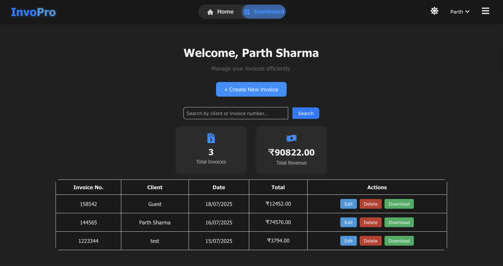

# 🧾 InvoPro – Smart Invoice Generator & Dashboard

**InvoPro** is a modern, responsive invoice generator web app built with **React** and **Firebase**. Users can easily create, manage, download, and store invoices — all with a sleek interface, dark/light theme support, and Google login integration.


---

## 🚀 Features

✅ Create professional invoices  
✅ Light & dark theme toggle  
✅ Download invoices as clean PDFs  
✅ Save invoices to Firestore  
✅ View, edit, or delete past invoices  
✅ Responsive dashboard & profile page  
✅ Google Login (Firebase Authentication)  
✅ Auto-filled user profile  
✅ Print-optimized layout

---

## 🔥 Tech Stack

- ⚛️ **React.js**  
- 🔥 **Firebase Auth & Firestore**  
- 🎨 **CSS Modules & Custom Styling**  
- 🖨️ **html2canvas + jsPDF for PDF export**  
- 🌙 **Dark/Light mode with CSS variables**  
- 📦 **LocalStorage for instant data backup**

---

## 📸 Screenshots

### 🏠 Landing Page


### 📂 Dashboard


### 👤 Profile Page


### 📄 View Invoice


---

## 🛠️ Getting Started

### 1️⃣ Clone the repository

```bash
git clone https://github.com/your-username/invoPro.git
cd invoPro
```

### 2️⃣ Install dependencies

```bash
npm install
```

### 3️⃣ Set up Firebase

- Create a Firebase project  
- Enable **Authentication (Google)**  
- Enable **Cloud Firestore**  
- Replace the config in `firebase.js` with your own credentials

### 4️⃣ Start the dev server

```bash
npm start
```

---

## 📁 Folder Structure

```
src/
├── components/
│   ├── InvoiceForm.js
│   ├── Dashboard.js
│   ├── ProfilePage.js
│   ├── Navbar.js
│   └── ...
├── context/
│   └── AuthContext.js
├── App.js
├── App.css
├── firebase.js
└── index.js
```

---

## 🙌 Acknowledgements

Thanks to:

- [React](https://reactjs.org/)
- [Firebase](https://firebase.google.com/)
- [jsPDF](https://github.com/parallax/jsPDF)
- [html2canvas](https://html2canvas.hertzen.com/)

---

## 📃 License

MIT © [Parth Sharma](https://github.com/ParthShxrma)